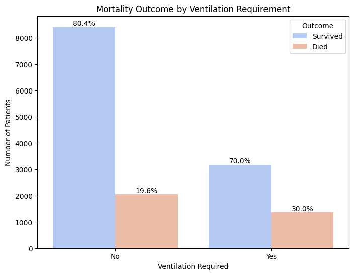
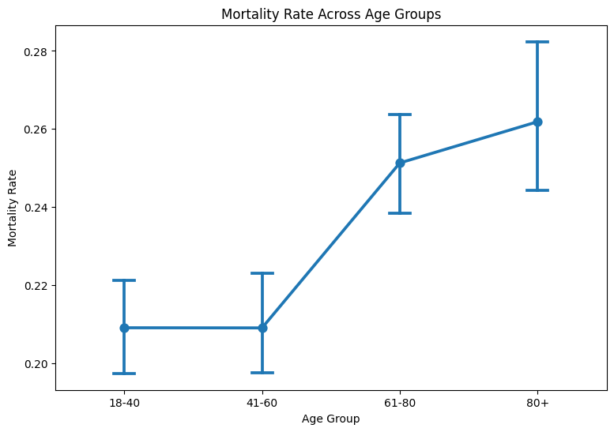
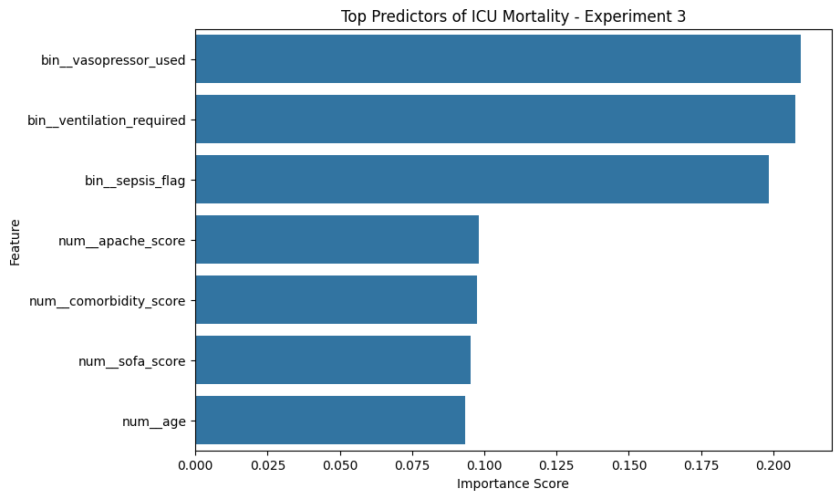

## Visualizations

The following figures are used across the project report, presentation, and poster.  
They highlight key data patterns, clinical insights, and model interpretability.

---

### 🔹 Class Distribution
Shows the imbalance between survival and mortality cases in the dataset, which influenced model design and evaluation.

---

### 🔹 Ventilation vs Mortality
Illustrates the relationship between ventilation requirement and mortality risk, indicating higher mortality among ventilated patients.

---

### 🔹 Age vs Mortality
Demonstrates how mortality rates increase across age groups, reflecting higher vulnerability in older patients.

---

### 🔹 Feature Importance
Highlights the most influential variables in mortality prediction, with clinical indicators such as vasopressor use, ventilation, and sepsis having the strongest impact.

---

### 🔹 Confusion Matrix
Shows the final model performance (Tuned XGBoost, threshold = 0.35), emphasizing high recall with some false positives.

